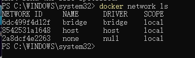
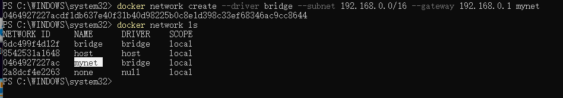

# 常用命令
```bash
# 添加自定义网络（默认是桥接模式）
docker network create 网络名称
# 解除容器绑定的网络
docker network disconnect 网络名称 容器名称
# 为容器重新指定网络
docker network connect 网络名称 容器名称 
```
# 自定义网络
## 查看所有docker网络
```bash
docker network ls
```
  
## 网络模式
1. bridge: 桥接 docker （默认）
2. none：不配置网络
3. host：和宿主机共享网络
4. container:：容器网络连通（用的少）
## 创建网络
```bash
docker network create --driver bridge --subnet 192.168.0.0/16 --gateway 192.168.0.1 mynet
```
1.  --driver bridge：桥接模式
2. --subnet 192.168.0.0/16：子网地址
3. --gateway 192.168.0.1：网关地址（类似路由器地址）
4. mynet：网络名称
查看我创建的网络
  
## 将容器启动放在自定义网络
--net mynet 使用指定网络
```bash
docker run -d -p:80:80 --name c_tomcat --net mynet tomcat-test
```
## 使用容器名称ping
```bash
docker exec -it tomcat-net01 ping tomcat-net02
```
# 网络连接
## 不同的网络下的容器相互连接、mynet网络与tomcat01容器连通
```bash
docker network connect mynet network tomcat01
```
执行后mynet会将tomcat01的网络加入到mynet网络下