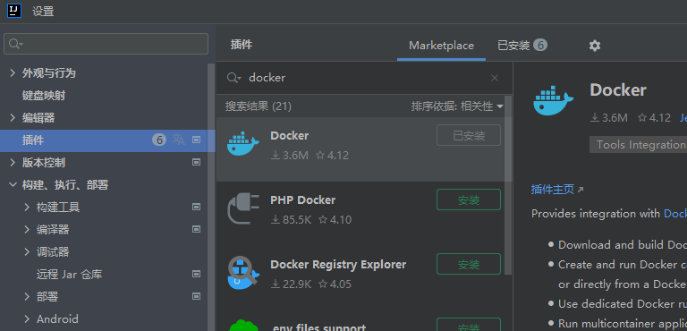
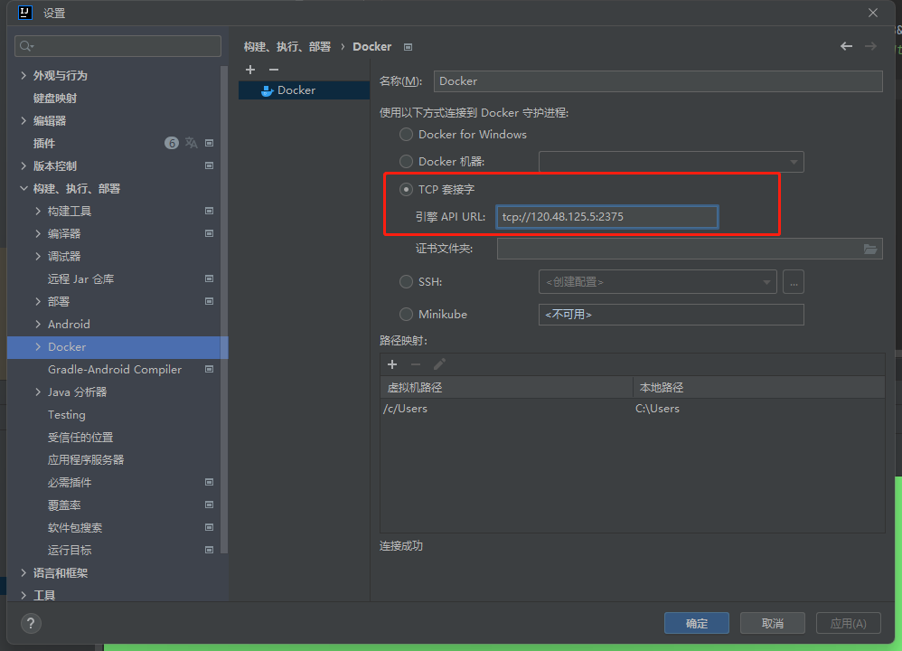
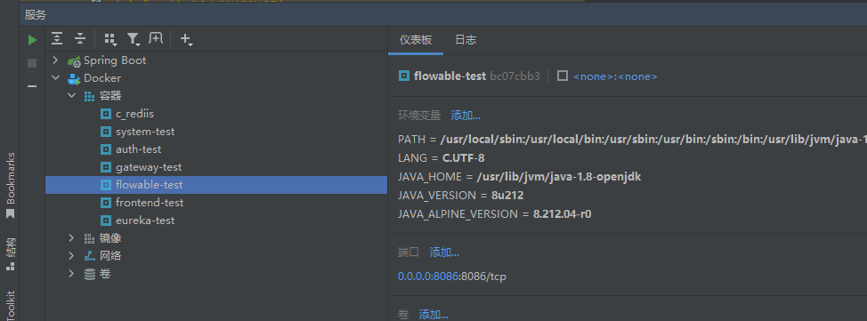
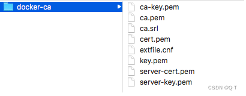
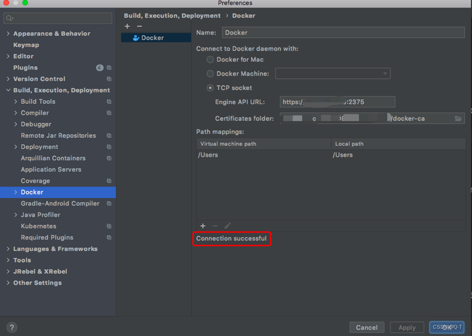

# docker配置
## 修改docker.service文件
```bash
vim /usr/lib/systemd/system/docker.service
```
## 需要修改的部分：
```bash
ExecStart=/usr/bin/dockerd -H fd:// --containerd=/run/containerd/containerd.sock
```
修改为 ->
```bash
ExecStart=/usr/bin/dockerd -H tcp://0.0.0.0:2375 -H unix://var/run/docker.sock
```
## 配置生效并重启docker
```bash
systemctl daemon-reload
systemctl restart docker
```
## 开放2375端口
```bash
firewall-cmd --zone=public --add-port=2375/tcp --permanent
firewall-cmd --reload
```
# idea配置
## 搜索安装docker插件

## 配置docker连接ip

## 查看docker镜像

# 配置SSL
## 创建一个目录用于存储生成的证书和秘钥
```bash
mkdir /docker-ca && cd /docker-ca
```
## 使用openssl创建CA证书私钥，期间需要输入两次密码，生成文件为ca-key.pem
```bash
openssl genrsa -aes256 -out ca-key.pem 4096
```
## 根据私钥创建CA证书，期间需要输入上一步设置的私钥密码，然后依次输入国家是 CN，省例如是Guangdong、市Guangzhou、组织名称、组织单位、姓名或服务器名、邮件地址，都可以随意填写，生成文件为ca.pem（注意证书有效期）
```bash
openssl req -new -x509 -days 365 -key ca-key.pem -sha256 -out ca.pem
```
## 创建服务端私钥，生成文件为server-key.pem
```bash
openssl genrsa -out server-key.pem 4096
```
## 创建服务端证书签名请求文件，用于CA证书给服务端证书签名。IP需要换成自己服务器的IP地址，或者域名都可以。生成文件server.csr
```bash
openssl req -subj "/CN=你的服务器ip" -sha256 -new -key server-key.pem -out server.csr
```
## 配置白名单，用多个用逗号隔开，例如： IP:192.168.0.1,IP:0.0.0.0，这里需要注意，虽然0.0.0.0可以匹配任意，但是仍然需要配置你的服务器IP，如果省略会造成错误
```bash
echo subjectAltName = IP:你的服务器ip,IP:0.0.0.0 >> extfile.cnf
```
## 将Docker守护程序密钥的扩展使用属性设置为仅用于服务器身份验证
```bash
echo extendedKeyUsage = serverAuth >> extfile.cnf
```
## 创建CA证书签名好的服务端证书，期间需要输入CA证书私钥密码，生成文件为server-cert.pem
```bash
openssl x509 -req -days 365 -sha256 -in server.csr -CA ca.pem -CAkey ca-key.pem \-CAcreateserial -out server-cert.pem -extfile extfile.cnf
```
## 创建客户端私钥，生成文件为key.pem
```bash
openssl genrsa -out key.pem 4096
```
## 创建客户端证书签名请求文件，用于CA证书给客户证书签名，生成文件client.csr
```bash
openssl req -subj '/CN=client' -new -key key.pem -out client.csr
```
## 要使密钥适合客户端身份验证，请创建扩展配置文件
```bash
echo extendedKeyUsage = clientAuth >> extfile.cnf
```
## 创建CA证书签名好的客户端证书，期间需要输入CA证书私钥密码，生成文件为cert.pem
```bash
openssl x509 -req -days 365 -sha256 -in client.csr -CA ca.pem -CAkey ca-key.pem \-CAcreateserial -out cert.pem -extfile extfile.cnf
```
## 删除不需要的文件，两个证书签名请求
```bash
rm -v client.csr server.csr
```
## 修改证书为只读权限保证证书安全
```bash
chmod -v 0400 ca-key.pem key.pem server-key.pem
chmod -v 0444 ca.pem server-cert.pem cert.pem
```
## 归集服务器证书
```bash
cp server-*.pem  /etc/docker/ && cp ca.pem /etc/docker/
```
## 最终生成文件如下，有了它们我们就可以进行基于TLS的安全访问了
1. ca.pem CA证书
2. ca-key.pem CA证书私钥
3. server-cert.pem 服务端证书
4. server-key.pem 服务端证书私钥
5. cert.pem 客户端证书
6. key.pem 客户端证书私钥.
## 配置Docker支持TLS
```bash
vi /usr/lib/systemd/system/docker.service
```
## 修改以ExecStart开头的配置，开启TLS认证，并配置好CA证书、服务端证书和服务端私钥
```bash
ExecStart=/usr/bin/dockerd --tlsverify --tlscacert=/etc/docker/ca.pem --tlscert=/etc/docker/server-cert.pem --tlskey=/etc/docker/server-key.pem -H tcp://0.0.0.0:2375 -H unix:///var/run/docker.sock
```
## 重新加载让配置生效
```bash
systemctl daemon-reload && systemctl restart docker
```
## 重启docker
```bash
service docker restart
```
## 在客户端测试连接
保存相关客户端的pem文件到本地
  
IDEA->Preferences->Bulild, Execution,Deployment->Docker->TCP socket

到此，Docker对外开放2375端口再也不怕被攻击了！

